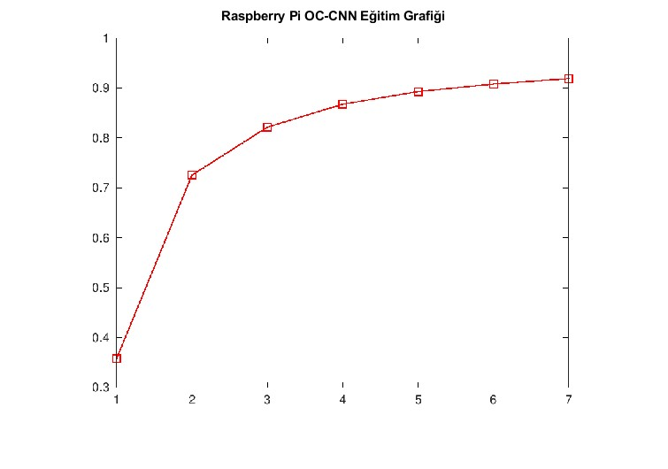

# OC-CNN: Online Censoring Based Convolutional Neural Networks on Edge Devices

## 🎯 Project Overview
This project focuses on optimizing the training time and resource allocation of Convolutional Neural Networks (CNNs) for edge computing devices. By implementing an **Online Censoring (OC)** mechanism, the architecture selectively filters out non-informative data during the training phase, significantly reducing computational load while maintaining accuracy.

## 🛠️ Hardware & Software Stack
* **Algorithm Design & Simulation:** MATLAB
* **Edge Hardware Validation:** Raspberry Pi
* **Domain:** Deep Learning, Signal Processing, Edge AI

## ⚙️ System Architecture & Methodology
The traditional CNN training process is highly resource-intensive. This project addresses this bottleneck by:
1. Identifying and censoring redundant data points in real-time.
2. Dynamically adjusting weights using only the most impactful features.
3. Deploying the optimized model onto a resource-constrained hardware platform (Raspberry Pi) to validate real-world performance.

*Figure 1: Proposed OC-CNN Architecture.*

## 📊 Results & Performance
The integration of the OC mechanism yielded significant improvements in training efficiency. Below are the comparative results and the physical hardware testing environment.

### Training & Testing Metrics

*Figure 2: Training accuracy and loss metrics.*

*Figure 3: Testing accuracy and loss metrics.*

### Hardware Validation Environment

*Figure 4: Real-time physical validation setup on Raspberry Pi edge hardware.*

## 🔒 Source Code Policy
Due to the academic and R&D nature of this project, the source code is currently kept private. This repository serves as a technical showcase of the system architecture, methodology, and performance outcomes. For technical inquiries, collaborations, or discussions regarding the methodology, please feel free to reach out via my portfolio contact links.
