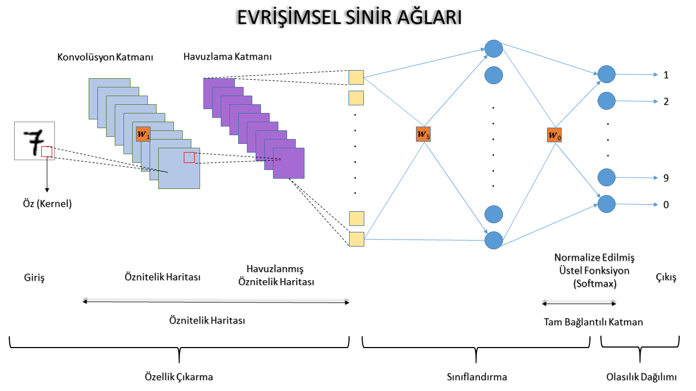
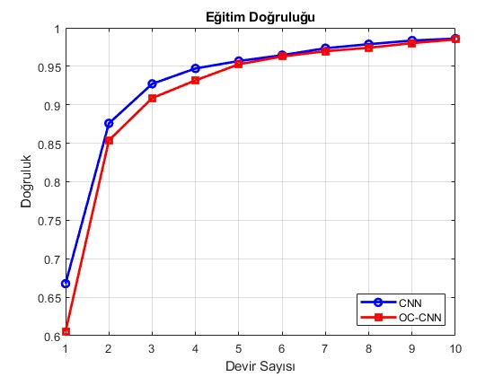
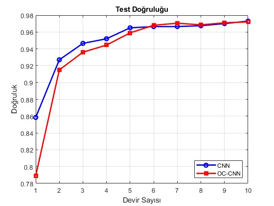
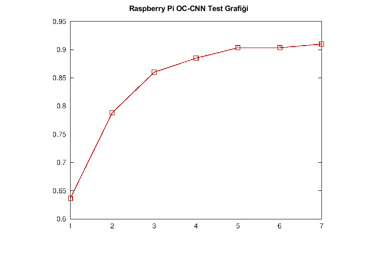
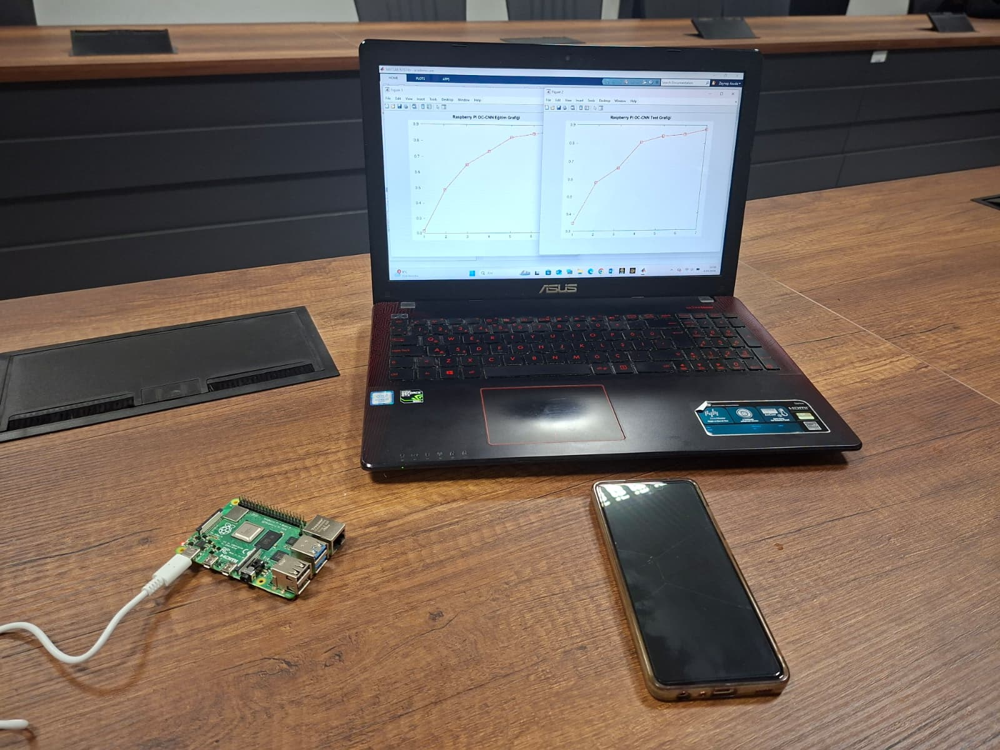
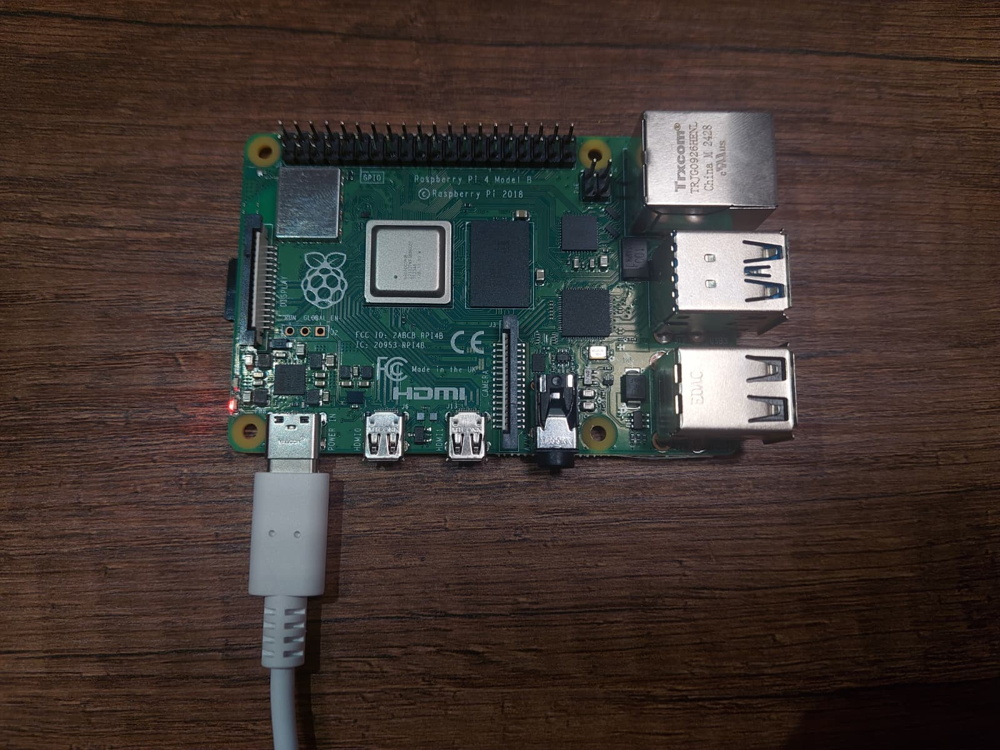

# OC-CNN: Online Censoring Based Convolutional Neural Networks on Edge Devices

## 🎯 Project Overview
This project focuses on optimizing the training time and resource allocation of Convolutional Neural Networks (CNNs) for edge computing devices. By implementing an **Online Censoring (OC)** mechanism, the architecture selectively filters out non-informative data during the training phase, significantly reducing computational load while maintaining accuracy.

## 🛠️ Hardware & Software Stack
* **Algorithm Design & Simulation:** MATLAB
* **Edge Hardware Validation:** Raspberry Pi
* **Domain:** Deep Learning, Signal Processing, Edge AI

## ⚙️ System Architecture & Methodology
The traditional CNN training process is highly resource-intensive. This project addresses this bottleneck by identifying and censoring redundant data points in real-time, adjusting weights using only impactful features, and deploying the model onto a resource-constrained hardware platform.

*Figure 1: Proposed OC-CNN Architecture.*

## 📊 Results & Performance Analysis
The integration of the OC mechanism was tested in multiple phases, starting from algorithmic simulations to real-world edge device validation.

### Phase 1: Algorithmic Optimization (50% Censoring Rate)
The initial tests demonstrate the impact of a 50% censoring rate on the network's learning capability.

*Figure 2: Training accuracy and loss metrics at 50% censoring rate.*

*Figure 3: Testing accuracy and loss metrics at 50% censoring rate.*

### Phase 2: Edge Hardware Validation (Raspberry Pi)
Following the algorithmic validation, the optimized model was deployed and tested on a Raspberry Pi to monitor real-world edge performance.

*Figure 4: Training metrics executed on the Raspberry Pi.*

*Figure 5: Testing metrics executed on the Raspberry Pi.*

### Hardware Validation Environment
The physical setup for testing the algorithms under real hardware constraints.

*Figure 6: Real-time physical validation setup on Raspberry Pi edge hardware.*

## 🔒 Source Code Policy
Due to the academic and R&D nature of this project, the source code is currently kept private. This repository serves as a technical showcase of the system architecture, methodology, and performance outcomes. For technical inquiries, collaborations, or discussions regarding the methodology, please feel free to reach out via my portfolio contact links.
